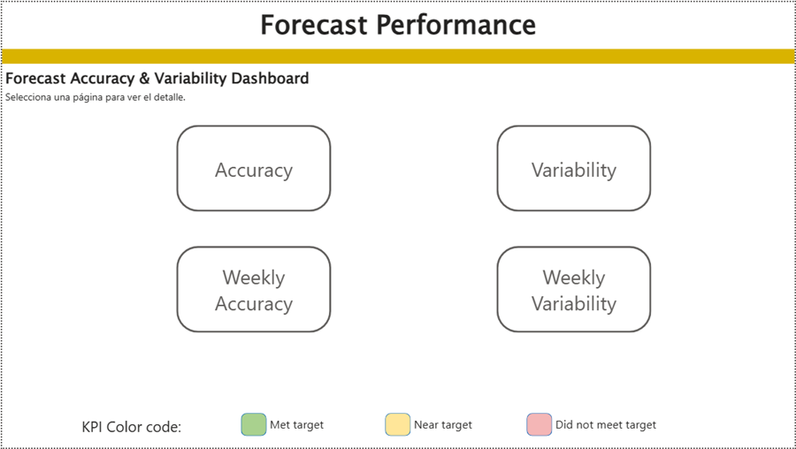
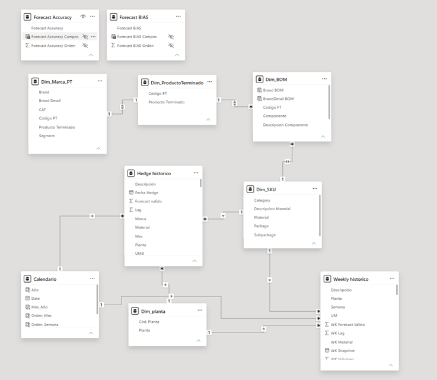

# Forecast Accuracy & Variability Dashboard

## Overview

This project showcases an executive Power BI dashboard developed to monitor forecast performance and support demand planning decisions.

The solution focuses on measuring forecast accuracy, forecast bias, and forecast variability while allowing users to identify the main materials responsible for planning deviations through interactive executive insights.

---

## Business Problem

Supply chain and procurement teams need to understand:

- How accurate forecasts are over time.
- Which materials contribute most to forecast deviations.
- Whether forecast changes improve or worsen planning accuracy.
- Which business areas require corrective actions.

This dashboard was designed to answer those questions through interactive analytics.

---

## Business Impact

The dashboard enables procurement and supply chain teams to:

- Monitor forecast performance at both monthly and weekly levels.
- Identify the materials with the largest positive and negative forecast deviations.
- Analyze forecast bias and demand variability.
- Support planning decisions through interactive executive insights.
- Reduce the time required to identify the main drivers of forecast error.

---

## Key Metrics

The dashboard includes custom DAX measures for:

- Forecast Accuracy (-1 and -3)
- Weekly Forecast Accuracy
- Forecast Bias
- Real vs Forecast
- Forecast Variability
- Weekly Forecast Variability
- Year-to-Date (YTD) calculations
- Dynamic Top 10 / Bottom 10 material analysis
- Dynamic date range filtering
- Dynamic forecast horizon selection (-1 / -3)

---

## Technical Highlights

- Built with a star schema data model.
- Developed advanced DAX measures for Forecast Accuracy, Bias, Variability and Real vs Forecast.
- Implemented custom YTD calculations consistent with monthly and weekly visualizations.
- Created dynamic measures driven by user-selected date ranges.
- Implemented executive Top/Bottom 10 material insights.
- Designed interactive drill-down analysis by Category, Package, Subpackage and Material.
- Optimized measures to ensure consistent KPI calculations across cards, matrices and charts.

---

## Data Model

The solution is built on a dimensional data model designed to support scalable analytics and high-performance DAX calculations.

---

## Skills Demonstrated

- Power BI
- DAX
- Power Query
- Data Modeling
- Business Intelligence
- Forecasting Analytics
- Supply Chain Analytics
- Procurement Analytics
- Demand Planning
- KPI Design
- Executive Dashboard Development
- Data Visualization

---

## Status

🚧 Currently under development.

Future improvements include:

- Finished Goods analysis
- Hectoliter conversion
- AI-generated executive insights
- Production demand analysis
